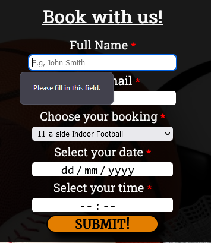

# Letchworth Sports Centre 
## Purpose of the project
The purpose of the sports centre would be to provide quality sport facilities that are functional through-out the whole year for publics use. The website is made to help the public find information regarding this Sport Centre such as about us, where it is, how we can be contacted e.g., email and phone number. The website will also provide information regarding what facilities and what sports we provide and additional information such as costs. Website will also enable the customer to book a sport session of their choice through the booking page.

The website needs to be easy to navigate so that any customer will be able to understand it and book through it, as the target audience is the general public ranging from young kids accompanied by adults to older public. 

## User stories
### 1. Home page
 - As a visiting user – I would like to find out information about the sports centre, what is has to offer and where it is so that I can decide if its suitable for me.
### 2. Facilities page
 - As a visiting user – I would like to see what sports I can play and the rules of booking e.g., how long for, how many people can play so I can decide on what I would like to book.
 - As a visiting user – I would like to see the price of booking to compare with another sport centre around me.
### 3. Contact Us
 - As a visiting user – I would like to find out information on how to contact the sports centre so I can book a session/ask question if needed be regarding options of booking.
 - As a visiting user – I would like to quickly and conveniently book sessions.

## Features
### 1. Home
#### The Header
- Located at the top of the page are 3 navigation buttons "Home" "Facilities" and "Contact Us" which are on a black background with white font colour, unless activated/highlighted, then the buttons turn to black font colour with orange background
- The 3 buttons are in a fixed position so that as the user scrolls, they will follow, allowing for easy and quick navigation to another page if needed
- Right beneath the 3 buttons is the sports centre's logo in 'Merriweather' font and in black colour making it stand out on the faint orange background of the pages.

#### The About Us and What We Offer sections
- The About Us section has a background of the Indoor Tennis/Badminton court and to the left of it is a text box that says About us and explains to a visiting user what we are about.

- The What We Offer section is showcasing a video of people using the Indoor Football pitch and on the right of the video is a quick summary of what the sports centre has to offer
- The What We Offer text box features a button that will take the user to the booking page and also the word "Facilities" is a link to the Facilities page. 
- The Video is responsive in the sense that the user can pause it if it's distractive when navigating through the Home page. It does not contain audio.

#### Opening Times and The Footer
- Located at the bottom is the additional information such as the opening times of the Sports center as it is a piece of very important information that a user might be looking for, therefore, it has been placed at the bottom next to the footer
- The footer contains other relevant information about the whole business. This information includes the links to social media that are represented by icons, but when clicked it takes you to a relevant social media page. It also includes contact details and the address.

### 2. Facilities Page
#### Booking information
- The Facilities page contains booking information such as a small description of the booking and the prices for booking times.
- Includes pictures of the facilities.
- Booking button on the right of the booking description on each sports box for the user's convenience.

### 3. Contact Us Page
#### Picture
- The picture on top of the information is the picture of the Sports Centre so the user is aware of what he can expect when going for the first time.

#### Contact Details and Opening times
- The first visible information on the Contact Us page is the contact details which include the phone number and email, as well as, allowing the user to fill out a form that will send their query straight to the sports centre's email. This is convenient for the user as they don't have to copy the e-mail and go into their email, instead, they can just send their query straight away by filling out the form.
- If the form is to be used and filled out, it is accompanied by a Submit button. However, the form will only submit once the user types in the required information. After pressing the submit button the user will be directed to a thank you page.
- Next information available is the opening hours.

#### Address
- The address is shown right below the opening times, it is the exact location of the sports centre so users have no trouble finding it.
- There's also a little paragraph that provides the user with information about how far the location is from the train station, a link to bus routes that opens in a new tab, and that there is parking available.
- Below is an `iframe` of the exact pin-pointed location on google maps that a user can navigate through

### 4. Booking page
#### Booking
- A booking page is just a form for the user to fill out if they want to book a facility via Online booking, it consists of 5 input forms, each is a required form to submit the booking. 
- Input text for user's full name and input e-mail for user e-mail, both required to proceed with booking.
- There's also a select element that allows the user to choose what facility they would like to book.
- Lastly, the two inputs are the date and time input, where users can select their desired day and time of their booking. 

## Future Features
- I would like to add to the webpage a log-in for accounts so that reoccurring customers can just log in with all their detail saved, including payment information, enabling them to book by just choosing what they want without filling in other information. 
- Membership deals, for customers that are reoccurring users of our facilities. For a monthly fee, they will be able to use certain facilities under the Terms & Conditions that membership would have. E.g, for £30 a month you can use the Table tennis facility you have 8 hours to use.

## Wireframes/Planning
I have used Wireframes to construct a very rough idea of the website. While building the website I have changed a lot compared to the initial ideas. 

- [Home page idea](/doc/readme-images/home-idea.png). While developing the website, I decided that the home page will have 3 sections "About us", "What we offer" and "opening time" instead of "About us" "Opening times", and a "Google maps `iframe`". With this decision also came a completely different layout where each section has its area and different decorative forms, one a background picture and the other a video. I also moved the `iframes` to the contact page. 

- [Facilities page idea](/doc/readme-images/facilities-idea.png) The first idea for the Facilities page was that it will have 6 boxes describing each sport and one book button at the bottom. I ended up minimising the sports boxes to 4 with 5 sports as 1 sport box includes two sports. Also changed the layout as the sports boxes are below each other, wherein the initial idea was opposite each other and each box has its booking button.

- [Contact Us page idea](/doc/readme-images/contact-us-idea.png) The Contact us page is where I stuck to the idea the most just changed the layout as I included the contact details, opening hours, and address together rather than separate like on the idea. 

## Testing
### 1. Code Validation 
- The HTML code has been validated in the W3C Markup Validation Service and all HTML files have come back with no errors.
- CSS Code has been validated in the W3C CSS Validation Service and all CSS code has come back with no errors (CSS level 3 + SVG)
- I have also used the lighthouse app on every page I have created to test for accessibility:
    - Home page 

    
    - Facilities page 

    
    - Contact Us page

    
    - Booking page 

    

### 2. Page testing
 - #### Home Page 
    - Home page required testing on the Navbar functionality, Book button and the hypertext link in the "What we offer" paragraph. 
      - I have tested the Navbar for its hover class, active class and if it opens the tabs it corresponds to. The hover class changes the tab button from its original state to a button with orange background and black font colour when the mouse hovers over it.  
        

      - The other test performed was clicking on all the buttons in the Navbar to ensure they correspond to their HTML pages which they do. Also had to ensure the active class works on the tab that is turned on, the settings make it so that the active tab stays with an orange background, black font, and is underlined. Output was as expected when testing.

        
    
      - Another test that I have done on the home page is for the booking button and the hypertext link test "Facilities". As the booking button has a transition I needed to make sure that when you hover over it, it will get slightly bigger as well as I made sure that when clicked the outcome will be that it takes you to the booking page. For the hypertext link, I tested it by clicking the "facilities" word in the "What we offer" text box and the outcome was it directed me to the facilities page.

 - ### Facilities page
    - The same testing went into the facilities page as into the home page, as they share the same booking button. I've tested all 4 buttons ensuring they get bigger by hovering over them and that they take you to the corresponding booking page when clicked.

 - ### Contact us page
    - On the contact us page I tested the input fields for their `required` attributes. I have done this by trying to submit the form without inputting any details into the form. Once all fields were field in I pressed the "Submit" which took me to the "thank you for submitting your query" page. 

     

 - ### Booking page
    - Similar testing to the contact page, where I tested for all the fields if they respond to their `required` attribute. Tested this by inputing details in each field, one at a time and then pressing the "Book now" button. The outcome was that until all fields were filled out I could not proceed to the "Thank you for booking" page that the "book now" button takes me to. 

    
    
## Fixed bugs
- The first button I made was the book button on the home page, I created it with `input type="submit" value" Book Now!"` and styled it to the page, however, after adding the `target="_blank` attribute to the `form` the `input` button completely changed its CSS style to different colours. To resolve this, instead of using `input` I used `button`.
- Social media icons did not want to be responsive to media queries and stayed the same size throughout changing sizes. Fixed by adjusting the positioning of it in HTML and then set to `display: flex;` in CSS.

## Unfixed bugs
- iOS (iPhone) changes button font `colour` and `box-shadow` color to white, the original colour is black. Can't find a solution. 

## Supported screens and Browsers
- Tested the site on Mozilla Firefox, Chrome, Safari (iOS), and Android (internet). No problems relating to design or the site itself on any of these sites apart from the unfixed bug on iOS. 

- I confirmed the website is responsive by using the dev toolkit on Mozilla firefox, as well as, opening the website on iPhones 12/13 Pro Max and Samsung Galaxy S10 +. Looks good and works properly on most standard screen sizes.

- Checked all the buttons if they work and respond accordingly by taking you to new tabs, all worked. Checked the form fields by inputting details, and each input corresponds to its required input and will not allow proceeding unless all and right information is provided. 

## Deployment
- Site was deployed to GitHub pages. The steps for deployment are as follows:
    - In the GitHub repository, navigate to the Setting Tab, then to the 'Pages' tab on the left
    - In the 'pages' tab find Source, press the dropdown menu and select 'Main' and save
    - Once saved, the page will provide a link to the completed website.

The live link can be found here - https://kcichy37.github.io/first-portfolio-project

## Credits
- Huge chunks of code has been done with the help of https://www.w3schools.com/. Helped with backgrounds, layouts and button transition. 
- Tutorials from [Kevin Powells](https://www.youtube.com/kepowob) on YouTube.
- Adapted form code from CI Coders Coffeehouse.

## Media 
- Majority of images used are from Google Images, for this reason "For Educational Purposes Only" has been disclosed in the footer. 
- Some images and the video are from https://www.pexels.com/
